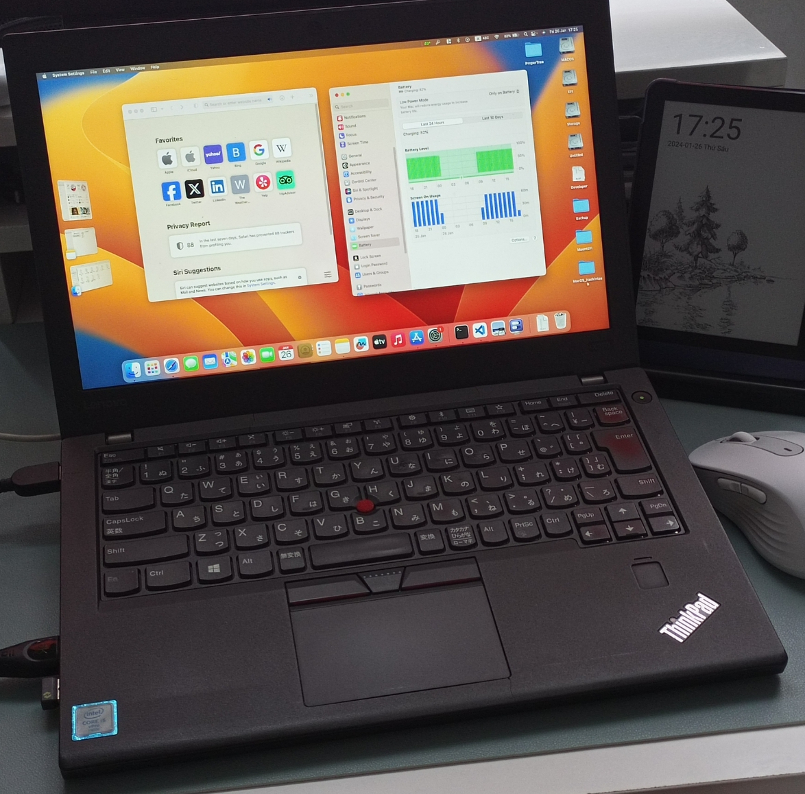
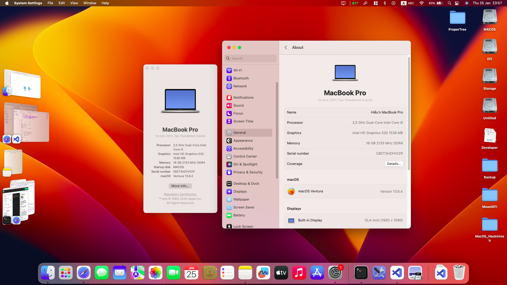

<h1 align="center">Lenovo ThinkPad X270 Hackintosh Ventura</h1>

    
    
    

## Warning ⚠️

<b>You should follow <a href="https://dortania.github.io/OpenCore-Install-Guide/"> Dortania Guides </a> for deeply understand.</b>
 
<b>You need to fill your own SMBIOS using this <a href="https://dortania.github.io/OpenCore-Install-Guide/config-laptop.plist/kaby-lake.html#platforminfo">guide</a></b>
 
<b>I am not responsible for any damages you may cause.</b>

## Specs
- <b>Model</b>: Thinkpad X270
- <b>CPU</b>: Intel(R) Core(TM) i5-6300U CPU @ 2.50GHz
- <b>GPU</b>: Intel HD Graphics 520
- <b>RAM</b>: 16 GB 2133MHz DDR4
- <b>Screen</b>: 12,4" (1920x1080)
- <b>Wi-Fi</b>: AX-210 (Wifi 6E)
- <b>Camera</b>: 720p
- <b>Battery</b>: Dual Batteries (24wh internal/external)

## Bios settings

<b>Config</b>
- `USB -> Always on USB` **Disabled**

<b>Security</b>
- `Security Chip` **Disabled**
- `Memory Protection -> Execution Prevention` **Enabled**
- `Virtualization -> Intel Virtualization Technology` **Enabled**
- `Virtualization -> Intel VT-d Feature` **Enabled**
- `I/O Port Access -> Wireless WAN` **Disabled**
- `I/O Port Access -> Memory Card Slot` **Disabled**
- `I/O Port Access -> Fingerprint Reader` **Disabled**
- `I/O Port Access -> WiGig` **Disabled**
- `Anti-Theft -> Computrace -> Current Setting` **Disabled**
- `Secure Boot -> Secure Boot` **Disabled**
- `Intel SGX -> Intel SGX Control` **Disabled**
- `Device Guard` **Disabled**

<b>Startup</b>
- `UEFI/Legacy Boot` **UEFI Only**
- `CSM Support` **No**

## Status

<b> What's working? ✅ 

 

| Feature                                | Description          |
| :------------------------------------- | -------------------    |
| CPU Power Management                   | Good |    
| Graphics Acceleration                  | Good |
| Battery                                | Supports dual batteries |
| Internal Camera                        | Good |
| All USB Ports                          | No DP on Type C port |
| HDMI Port                              | Including HDMI Audio |
| Ethernet Port                          | Good |
| Wifi/Bluetooth                         | Wifi 6E |
| TouchPad/TrackPoint                    | Including gestures and click |
| Keyboard                               | Including all `Fn` keys |
| Sleep                                  | Good |
| Shutdown/Reboot                        | Good |

<b> What's not working❗

 

| Feature                              | Description          |
| :----------------------------------- | -------------------- |
| Fingerprint Reader                   | Not Supported, `Disabled` in BIOS |
| Wireless WAN                         | Not Supported, `Disabled` in BIOS|
| AirDrop                              | Need Apple compatible Wifi/Bluetooth card|   
| DRM                                  | iGPU is not supported, use browsers instead|  
| Audio Jack                           | Buzzing Sound|   

<b> Not tested 🔄

 

| Feature                               | Description          |
| :-----------------------------------  | -------------------- |
| SD card Reader                        | `Disabled` in BIOS |
| iServices                             | Need `Valid` Serial |

## Credits
- [Apple](https://apple.com) for MacOS.
- [Acidanthera](https://github.com/acidanthera) for their hackintosh work.
- [Dortania](https://dortania.github.io/OpenCore-Install-Guide/) for great and detailed guides.
