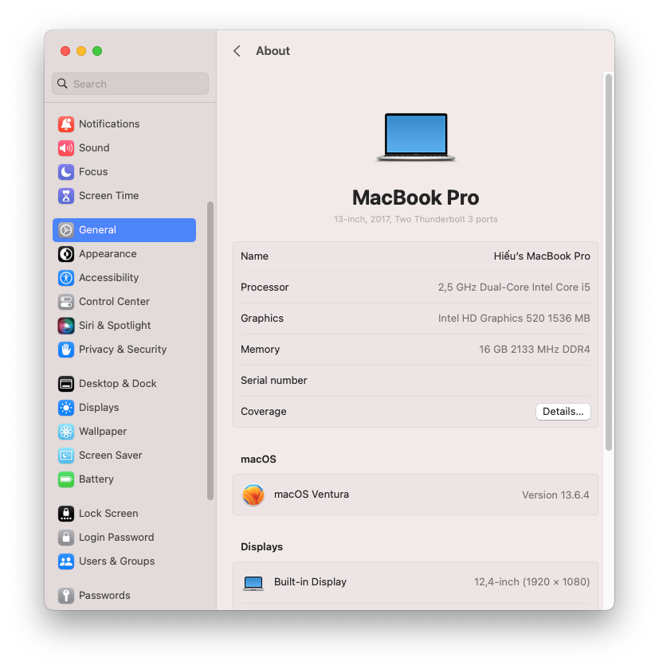

<h1 align="center">Hackintosh For Lenovo ThinkPad X270</h1>

    
    
    

## Warning ⚠️

<b>I am not responsible for any damages you may cause.

## Specs
- <b>Model</b>: Thinkpad X270
- <b>CPU</b>: Intel(R) Core(TM) i5-6300U CPU @ 2.50GHz
- <b>GPU</b>: Intel HD Graphics 520
- <b>RAM</b>: 16 GB 2133MHz DDR4
- <b>Screen</b>: 12,4" (1920x1080)
- <b>Wi-Fi</b>: AX-210 (Wifi 6E)
- <b>Camera</b>: 720p
- <b>Battery</b>: Dual Batteries (24wh internal/external)

## Bios settings

<b>Security</b>
- `Security Chip` **Disabled**
- `Memory Protection -> Execution Prevention` **Enabled**
- `Virtualization -> Intel Virtualization Technology` **Enabled**
- `Virtualization -> Intel VT-d Feature` **Enabled**
- `Anti-Theft -> Computrace -> Current Setting` **Disabled**
- `Secure Boot -> Secure Boot` **Disabled**
- `Intel SGX -> Intel SGX Control` **Disabled**
- `Device Guard` **Disabled**

<b>Startup</b>
- `UEFI/Legacy Boot` **UEFI Only**
- `CSM Support` **No**

## Features

<b> What's working? ✅ 

 

| Feature                                | Status | Description          |
| :------------------------------------- | ------ | ------------------- |
| CPU Power Management                   | ✅   | Good |
| Graphics Acceleration                  | ✅   | Good |
| Battery                                | ✅   | Supports dual batteries |
| Internal Camera                        | ✅   | Good |
| All USB Ports                          | ✅   | No DP on Type C port |
| HDMI Port                              | ✅   | Including HDMI Audio |
| Ethernet Port                          | ✅   | Good |
| Wifi                                   | ✅   | Wifi 6E |
| Bluetooth                              | ✅   | Good |
| TouchPad                               | ✅   | Including gestures and click |
| TrackPoint                             | ✅   | Good |
| Keyboard                               | ✅   | Including all Fn keys |
| Sleep                                  | ✅   | Good |
| Shutdown/Reboot                        | ✅   | Good |

<b> What's not working❗

 

| Feature                              | Status | Description          |
| :----------------------------------- | ------ | -------------------- |
| Fingerprint Reader                   | ❌     | Not Supported |
| SD card Reader                       | ⛔     | Untest |
| Wireless WAN                         | ❌     | Not Supported|
| AirDrop                              | ❌     | Need Apple compatible Wifi/Bluetooth card|   
| DRM                                  | ❌     | iGPU is not supported, use browsers instead|  
| Audio Jack                           | ❌     | Buzzing Sound|   

